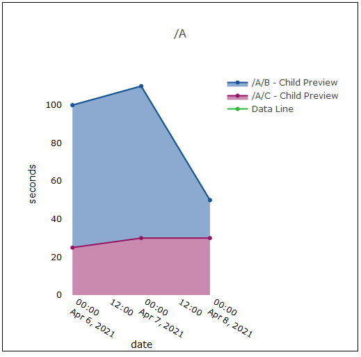

# Example:  Area Plot

This example demonstrates how to configure Watchr to generate area plots.  An area plot displays a single line with filled, colored areas beneath the line.  A colored area is assigned to each child of the parent line.  [**You can read more about area plots at Plotly's website.**](https://plotly.com/javascript/filled-area-plots/)

For area plots, we need to make some implicit assumptions about our configuration file's extractors, specifically what "X" and "Y" mean conceptually:

## Watchr Config:  config.json
	{
	    "plots" : {
	        "files" : {
	            "fileName": "performance*",
	            "type" : "xml"
	        },
	        "plot" : [
	            {
	                "type" : "areaPlot",
	                "legend" : "true",
	                "autoname" : {
	                    "useProperty" : "y/path",
	                    "formatByRemovingPrefix" : "R$\\/nightly_run_\\d{4}\\-\\d{2}\\-\\d{2}"
	                },
	                "dataLines" : [
	                    {
	                        "name" : "Data Line",
	                        "x" : {
	                            "getElement" : "performance-report",
	                            "getPath": "*",
	                            "getKey" : "date",
	                            "unit" : "date"
	                        },
	                        "y" : {
	                            "getElement" : "performance-report|timing",
	                            "getPath": "*/A",
	                            "getPathAttribute": "name",
	                            "getKey" : "value",
	                            "strategy" : {
	                                "getFirstMatchOnly" : "false",
	                                "recurseChildGraphs" : "true"
	                            },
	                            "unit" : "seconds"
	                        }
	                    }
	                ]
	            }
	        ]
	    }
}

## Data File:  performance_1.xml

	<?xml version="1.0"?>
	<performance-report date="2021-04-05T22:21:21" name="nightly_run_2021-04-05">
	    <timing name="A" value="100.0">
	        <timing name="B" value="75.0">
	            <timing name="D" value="25.0"/>
	            <timing name="E" value="50.0"/>
	        </timing>
	        <timing name="C" value="25.0">
	            <timing name="F" value="15.0"/>
	            <timing name="G" value="10.0"/>
	        </timing>
	    </timing>
	</performance-report>

## Data File: performance_2.xml

	<?xml version="1.0"?>
	<performance-report date="2021-04-06T22:21:21" name="nightly_run_2021-04-06">
	    <timing name="A" value="110.0">
	        <timing name="B" value="80.0">
	            <timing name="D" value="30.0"/>
	            <timing name="E" value="50.0"/>
	        </timing>
	        <timing name="C" value="30.0">
	            <timing name="F" value="15.0"/>
	            <timing name="G" value="15.0"/>
	        </timing>
	    </timing>
	</performance-report>

## Data File: performance_3.xml

	<?xml version="1.0"?>
	<performance-report date="2021-04-07T22:21:21" name="nightly_run_2021-04-07">
	    <timing name="A" value="50.0">
	        <timing name="B" value="20.0">
	            <timing name="D" value="5.0"/>
	            <timing name="E" value="15.0"/>
	        </timing>
	        <timing name="C" value="30.0">
	            <timing name="F" value="20.0"/>
	            <timing name="G" value="10.0"/>
	        </timing>
	    </timing>
	</performance-report>

## What does this example demonstrate?

"A" has two children, "B" and "C".  The plot shown above displays "B"'s percentage of "A" over time in the blue area, while "C"'s percentage of "A" is shown in the pink area.  "A" is drawn as a green line behind "B" and "C" - in practice, "A" can be shown by toggling the visibility of "B" and "C."  

## Command Line:

	watchr config.json <directory containing performance xml files>