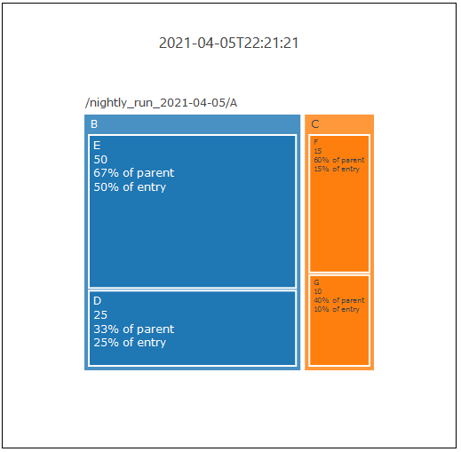

# Example:  Treemap

This example demonstrates how to configure Watchr to generate treemaps.  A treemap is a type of plot that displays boxes of differing sizes, with smaller boxes being drawn inside larger boxes.  The boxes' relative sizes and positions provide a visual representation of components and how a given component can be broken down into smaller sub-components.  [**You can read more about treemaps at Plotly's website.**](https://plotly.com/python/treemaps/)

For treemaps specifically, we need to make some implicit assumptions about our configuration file's extractors, specifically what "X" and "Y" mean conceptually:

 * The X extractor should be used to designate "moments" at which we should create new treemaps.  For example, creating a new treemap each time a new data file is added to your database.  Therefore, the X extractor **cannot** be recursive.
 * The Y extractor should be used to extract the entire treemap hierarchy.  Therefore, it should be recursive (though this is not strictly enforced like the X extractor).
 * Given that the extracted data will be shaped like a tree, the important measured values will be at the leaves of the tree.  If the value at a given non-leaf node does not equal the sum of the values at its child nodes, the value is discarded in favor of the calculated sum value of its child nodes.

## Watchr Config:  config.json
	{
	    "plots" : {
	        "files" : {
	            "fileName": "performance",
	            "type" : "xml"
	        },
	        "plot" : [
	            {
	                "type" : "treemap",
	                "autoname" : {
	                    "useProperty" : "x/key"
	                },
	                "dataLines" : [
	                    {
	                        "name" : "My First Treemap",
	                        "x" : {
	                            "getPath": "*", 
	                            "getElement" : "performance-report",
	                            "getKey" : "date"
	                        },
	                        "y" : {
	                            "getElement" : "performance-report|timing",
	                            "getPath": "nightly_run_*/*",
	                            "getPathAttribute": "name",
	                            "getKey" : "value",                          
	                            "strategy" : {
	                                "getFirstMatchOnly" : "false",
	                                "recurseChildGraphs" : "true"
	                            },
	                            "unit" : "seconds"
	                        }
	                    }
	                ]
	            }
	        ]
	    }
	}

## Data File:  performance.xml

    <?xml version="1.0"?>
    <performance-report date="2021-04-05T22:21:21" name="nightly_run_2021-04-05">
        <timing name="A" value="100.0">
           <timing name="B" value="75.0">
               <timing name="D" value="25.0"/>
               <timing name="E" value="50.0"/>
           </timing>
           <timing name="C" value="25.0">
               <timing name="F" value="15.0"/>
               <timing name="G" value="10.0"/>
           </timing>
        </timing>
    </performance-report>

## What does this example demonstrate?

Note the outermost timing element named "A" has a value of "100.0".  Using the child elements in the XML hierarchy, we can understand how A is subdivided into component parts.  A's immediate children are "B" and "C", with values of 75.0 and 25.0 respectively.  B and C can be subdivided as well.  B has two children - "D" and "E" - which sum to B's value.  Likewise, C has two children - "F" and "G" - which sum to C's value.

Thanks to Plotly, the plot generated from this example will be interactive.  Simply click on any of the inner boxes to zoom into that box and get a better view of its child boxes.

## Command Line:

	watchr start
    watchr config config.json
    watchr add performance.xml
    watchr run